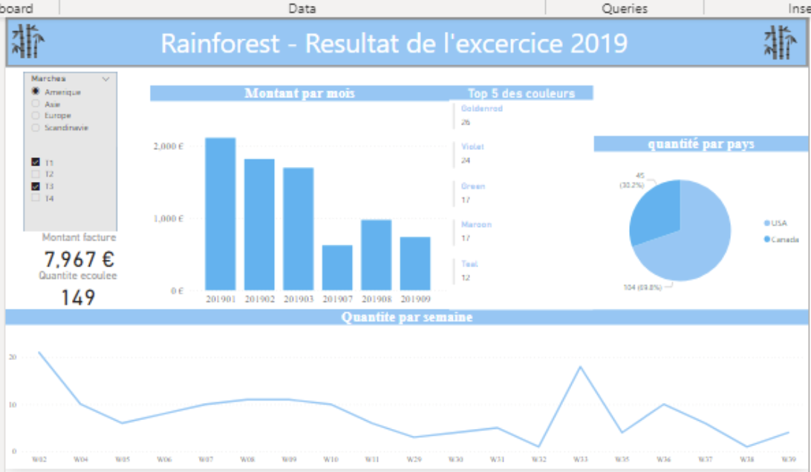
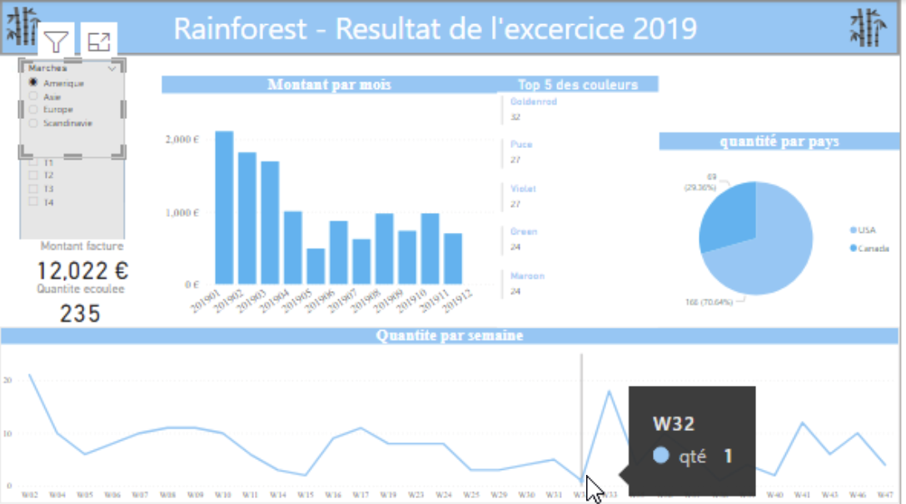
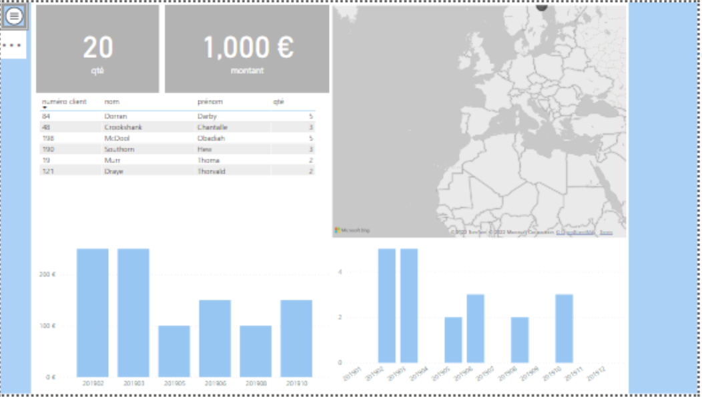
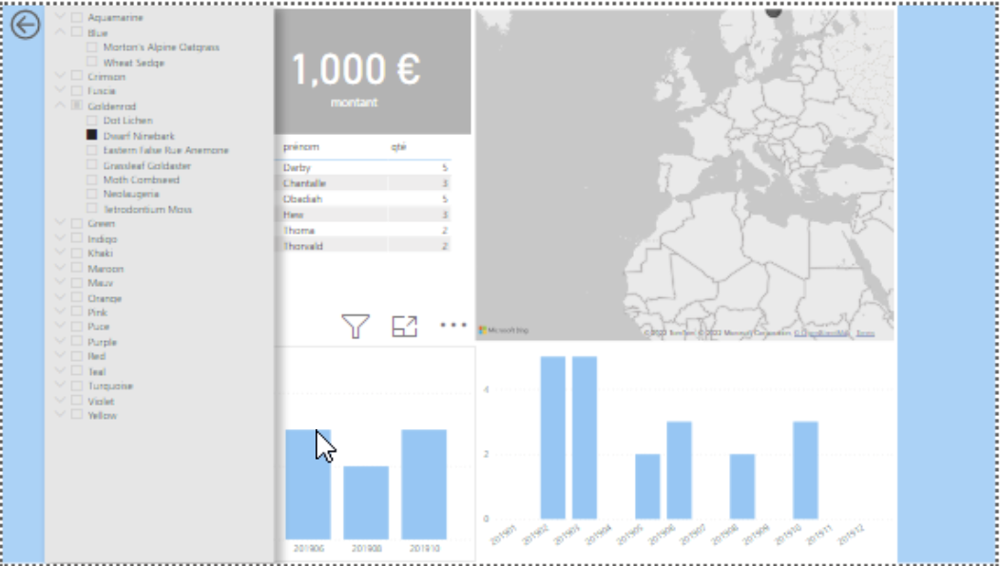
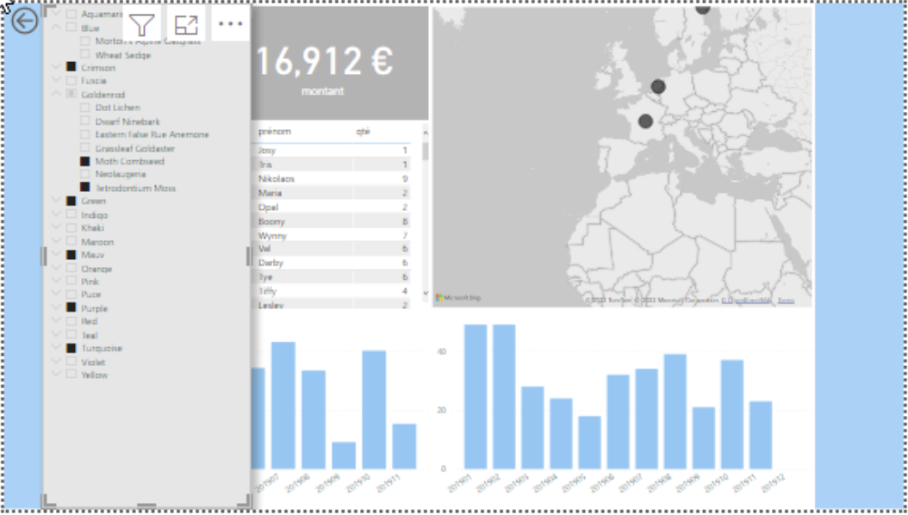
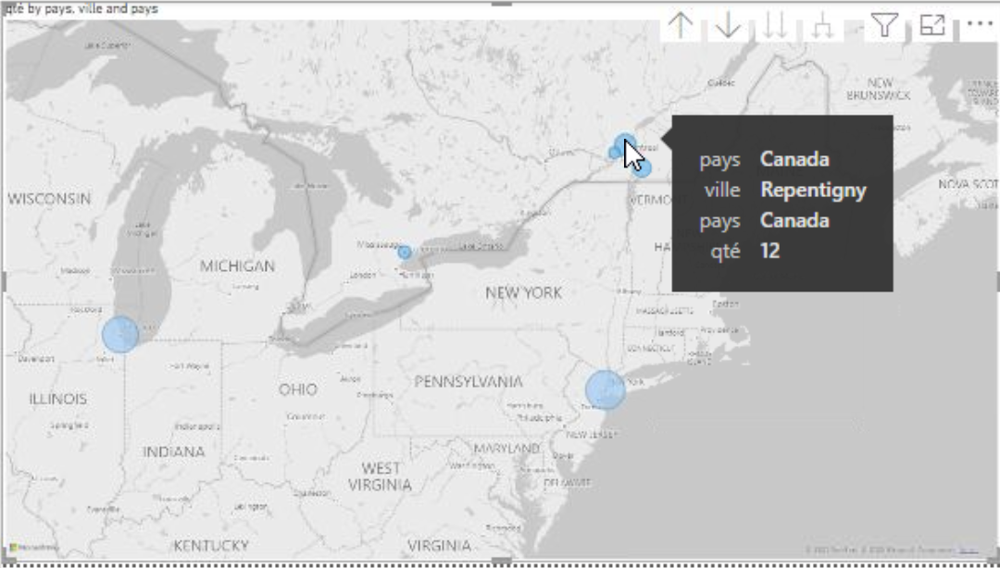
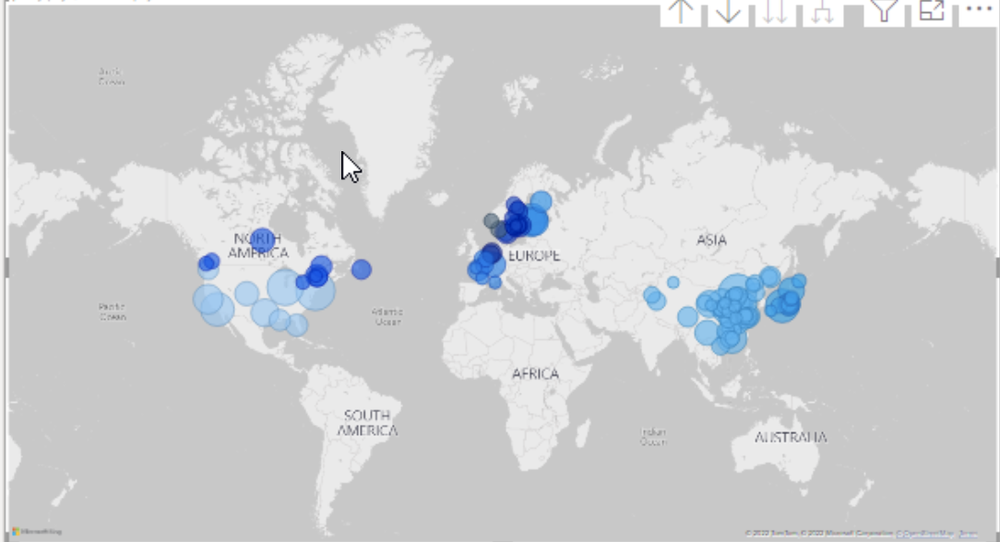

# RainForest_Resultats_de_Excercie2019 (POWER BI)

In this training, I discovered Power BI, Microsoft's solution for analyzing, viewing and sharing data. 

# Trought this training I learned :

* How to query data to Excel or other sources and prepare these items. 
* How to create tables
* How to create time tables, relationships, and how to use data in a visual way. 
* I proceed to filter and exploit the data in PDF and Excel formats.

# Charts and Dashboard Screenshots

* The Final Dashbord

* The Dashbord filtred exemple

* Interactif Dashboard

*The Dashbord button open exemple

*The Dashbord button open with filter exemple

*The Map details open. 

*The Map details. 

